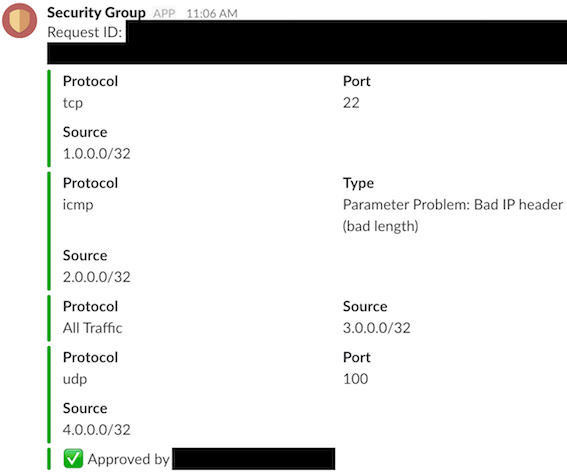

# AWS Security Group Approval via Slack
The ability to revert unapproved security group (firewall) inbound changes in Amazon Web Services and subsequently approve or disapprove the request via Slack API and interactive buttons.

## Requesting to Add/Update/Delete Rules
1. Open the Amazon EC2 console at https://console.aws.amazon.com/ec2/.
2. In the navigation pane, choose Security Groups.
3. Select the security group to update, and choose Inbound Rules to add/update/delete rules for inbound traffic.
4. Choose Edit. Modify the rule entry as required and choose Save.


5. Within a few seconds, a request will be sent via Slack API to the approvers for proper action and the security group will be reverted back to its original state. The request will also be posted to the slack monitoring channel.


6. Once approved/denied, another message will be posted to the slack monitoring channel.



## Approving/Denying Requests
1. Once the change to a security group is detected, a message will be sent to the slack approving channel for proper action. Message information includes a unique request id, requester, add/remove action, group ID, AWS account, and inbound rules.


2. Simply click the approve button to apply the rule change or click the deny button to deny the request.


## Limitations
1. It takes a few seconds (around 30 seconds) for Cloudwatch to trigger the initial Lambda function. There will be a short period where a rule is still subject for reversion by the Lambda function.
2. Rule edits are treated as two separate add and remove requests.

## Back-End
### Receiving Requests


Any rule add/edit cloudwatch event in AWS account B will trigger a Lambda function that reverts the security group to its original state, publish to an SNS topic in AWS account A, and send a message to Slack. The SNS topic in AWS account A will trigger a Lambda function that stores the request in DynamoDB.

### Approving/Denying Requests


Once an approver acts on a request by pressing a button, Slack sends an HTTP to an API Gateway in AWS Account A. The API Gateway triggers a Lambda function that would update DynamoDB. If the approver denies the request, the Lambda function would just tag the request as ‘denied’. Otherwise, if the approver approves the request, the Lambda function would tag the request as ‘approved’ and publish to an SNS topic in AWS Account B. The SNS topic in AWS account B will trigger a Lambda function that applies the requested rule changes to the specified security group. If an error occurs (e.g. duplicate rule, non existing rule), the request would be tagged as error.

### Create Slack Channel

We will be creating two Slack channels. One for the approval of the security group request (secgroup_approve) and one for the monitoring of the security group requests (secgroup_monitoring).

In the left sidebar, click the plus icon next to Channels. Use the toggle to decide whether your channel will be public or private. Enter the channel name. Add a purpose to let members know what the channel is about. Select members to invite. Click the invite box to browse a list of teammates, or start typing a name to narrow your search. If you’d like to skip this step, you can always send invitations later. When you’re ready, click Create channel.

### Create a Slack App

Go to https://api.slack.com/apps and log in to your workspace if you haven’t already. Click the “Create New App” button.

Name your app with something descriptive and select your development Slack workspace.

Take note of the Verification Token provided by Slack. Some of our Lambda functions will be needing this token to verify that requests are actually coming from Slack.

### Set-up Slack App Incoming Webhooks

For the app to be able to post messages from external sources into Slack, it needs to have its own associated incoming webhook. Head over to the "Incoming Webhooks" section of the Slack app and activate incoming webhooks.

We will be creating two webhooks. One to post to the approval channel and one to post to the monitoring channel.

Click the “Add New Webhook to Workspace” and authorize the app to post to the two channels.

Take note of the two generated webhook URLs. We will be needing them later.


### Create AWS IAM Role for Lambda

Do the following in AWS Account A and AWS Account B.

Go to https://console.aws.amazon.com/iam/home and log in to AWS if you haven’t already. In the left sidebar, click on “Roles”, then “Create role”.

Choose Lambda under AWS service, then click "Next: Permissions".

Click "Next: Review" without attaching any policy.

Click "Create Role"

Add the following inline policy to the newly created role LambdaRoleSecurityGroup:

```
{
    "Version": "2012-10-17",
    "Statement": [
        {
            "Effect": "Allow",
            "Action": [
                "ec2:DescribeSecurityGroups",
                "ec2:AuthorizeSecurityGroupEgress",
                "ec2:AuthorizeSecurityGroupIngress",
                "ec2:RevokeSecurityGroupEgress",
                "ec2:RevokeSecurityGroupIngress"
            ],
            "Resource": [
                "*"
            ]
        },
        {
            "Effect": "Allow",
            "Action": [
                "logs:CreateLogGroup",
                "logs:CreateLogStream",
                "logs:PutLogEvents"
            ],
            "Resource": [
                "*"
            ]
        },
        {
            "Effect": "Allow",
            "Action": [
                "dynamodb:DescribeStream",
                "dynamodb:GetRecords",
                "dynamodb:GetShardIterator",
                "dynamodb:ListStreams"
            ],
            "Resource": "arn:aws:dynamodb:*:*:table/securityGroupRequests/stream/*"
        },
        {
            "Effect": "Allow",
            "Action": [
                "dynamodb:PutItem",
                "dynamodb:GetItem",
                "dynamodb:UpdateItem",
                "dynamodb:Scan"
            ],
            "Resource": "arn:aws:dynamodb:*:*:table/securityGroupRequests"
        },
        {
            "Effect": "Allow",
            "Action": [
                "sns:*"
            ],
            "Resource": [
                "arn:aws:sns:*:*:applySecurityGroupChange",
                "arn:aws:sns:*:*:securityGroupChange",
                "arn:aws:sns:*:*:denySecurityGroupChange"
            ]
        }
    ]
}
```

### Enable CloudTrail

If CloudTrail is not yet set up, activate it and feed the logs to CloudWatch using the instructions at https://docs.aws.amazon.com/awscloudtrail/latest/userguide/send-cloudtrail-events-to-cloudwatch-logs.html. Do this in all accounts.

### Set-up DynamoDB

Go to https://console.aws.amazon.com/dynamodb/home and log in to AWS Account A if you haven’t already. Click on “Create table”.

Name the table as “securityGroupRequests” and name the primary key as “requestId” with type string. You may modify the table settings depending on your requirements. Click on “Create”.

### Set-up Lambda Functions

In this scenario, the database storing all requests from multiple AWS accounts will be located in AWS account A. We will be deploying 3 Lambda functions in AWS account A and 2 Lambda functions in AWS account B (or more).

Go to https://console.aws.amazon.com/lambda/home and log in to AWS if you haven’t already. Click on “Create function”.

In AWS Account A, create a Python 2.7 function named “buttonClick”. Use the “LambdaRoleSecurityGroup” role.

Set the timeout to 5 mins and set the memory to 1GB or more. This is to ensure the buttonClick function sends a response to Slack within 3 seconds (Slack has a timeout of 3 seconds for the HTTP POST reply).

Set the following environment variables:
expectedToken - the apps’s Verification Token provided by Slack.
monitoringHookUrl - the generated webhook URL for the secgroup_monitoring channel

Do the following in AWS Account B:

1. Create a Lambda function named revertSecurityGroup. Use the “LambdaRoleSecurityGroup” role.  
  
Set-up the following environment variables:  
slackChannel - secgroup_approve  
approvalHookUrl - the generated webhook URL for the secgroup_approve channel  
monitoringHookUrl - the generated webhook URL for the secgroup_monitoring channel  
  
Make sure to set the timeout to 5 mins.  

2. Create a Lambda function named applySecurityGroupChange. Use the “LambdaRoleSecurityGroup” role.  
  
Set-up the following environment variables:  
monitoringHookUrl - the generated webhook URL for the secgroup_monitoring channel  
  
Make sure to set the timeout to 5 mins.  

### Set-up API Gateway

Go to https://console.aws.amazon.com/lambda/home and log in to AWS Account A if you haven’t already. Click on “Create API”.

Name the API as “Slack API” and click on “Create API”.

Click on “Actions” and then “Create Method”.

Select “POST” and click on the check mark.

Select “Lambda Function” for the Integration type and select the buttonClick Lambda Function. Leave the “Use Lambda Proxy Integration” checkbox unchecked. Click “Save”.

Click on “Integration Request”.

Under “Body Mapping Templates”, select “When there are no templates defined”. Click on “Add mapping template”.

Type in “application/x-www-form-urlencoded” as the Content-Type then click the check mark.

Type in {"body": $input.json("$")} as the template then click “Save”

Under “Actions”, click “Deploy API”.

Type in “prod” for the Stage name then click “Deploy”.

Take note of the generated Invoke URL. We will be needing this later to set-up our Slack app’s interactive components.

### Set-up Slack App Interactive Components

For the app to be able to post messages into our AWS API Gateway, it needs to have its interactive components enabled. Head over to the "Interactive Components" section of the Slack app and click “Enable Interactive Components”.

Enter the URL of the API Gateway in the Request URL field and click “Enable Interactive Components”.

### Set-up SNS Triggers

We will be using SNS to be able to trigger cross-account Lambda functions.

Go to https://console.aws.amazon.com/sns/home and log in to AWS if you haven’t already. In the left sidebar, click on “Topics”, then “Create new topic”.

Type in the topic name and click on “Create topic”.

Allow other AWS accounts to publish to the topic by editing the topic policy. Click on the ARN on the newly created topic and edit the topic policy.

Select “Only these AWS users” under message publishers and type in the AWS account numbers.

Whenever a message is published to a topic, the appropriate lambda function should be triggered. Click on “Create subscription”.

Choose “AWS Lambda” as the Protocol and select the lambda function to be triggered as the endpoint. Click on “Create subscription”.

In AWS Account A, create the following SNS topics:
errorHandlerSecurityGroupChange - triggers Lambda function errorHandlerSecurityGroupChange
securityGroupChange - triggers Lambda function securityGroupChange
denySecurityGroupChange - triggers Lambda function denySecurityGroupChange

In AWS Account B, create the following SNS topics:
applySecurityGroupChange - triggers Lambda function applySecurityGroupChange

### Set-up CloudWatch Trigger

We will be using CloudWatch Events to trigger the initial Lambda function (revertSecurityGroup).

Go to https://console.aws.amazon.com/cloudwatch/home and log in to AWS if you haven’t already. In the left sidebar, click on “Rules” under “Events”, then “Create rule”.

Select “Build custom event pattern” and type in the event pattern below:

```
{
  "source": [
    "aws.ec2"
  ],
  "detail-type": [
    "AWS API Call via CloudTrail"
  ],
  "detail": {
    "eventSource": [
      "ec2.amazonaws.com"
    ],
    "eventName": [
      "AuthorizeSecurityGroupIngress",
      "RevokeSecurityGroupIngress"
    ],
    "userIdentity": {
      "type": [
        "IAMUser"
      ]
    }
  }
}
```

The event pattern would invoke the target Lambda function whenever an inbound rule is added or removed from a security group by an IAM User.

Click on “Add target”. Select “Lambda function” from the dropdown menu, then select the revertSecurityGroup function. Click on “Configure details”.

Name the rule as “revertSecurityGroup”. Ensure the state is “Enabled” then click “Update rule”.